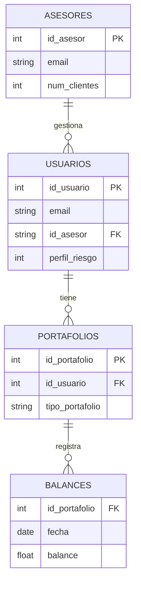

# DATA MANAGEMENT
## A tener en cuenta: 
- filter(table,  field or  value):  que  filtra  campos o  valores  de una  tabla,  dónde  tabla es el nombre de la tabla -p. Ej. “Asesores”; field es un campo de tabla -p. ej. “num_clientes”- y value el valor del campo - p. Ej. “12  

- join(from table, to table, fields, new_table): que une las tablas from table- p. Ej. 
“Usuarios”- con la tabla to table, utilizando como indicador el valor del campo fields- 
p. ej. “Id_usuario”, creando la tabla new_table.  

- drop(table, field or value): que elimina los campos o valores de una tabla.  

# Ejercicio 

Utilizando las tablas descritas, escriba una secuencia de funciones “filter”, “join” y “drop” que permita consultar el valor de los balances, para un rango de fechas y según tipo de portafolio, de los portafolios de los usuarios con asesor “insightswm@gmail.com”.

# Para entender un poco:

Realizaremos un pequeño E-R para comprender como funciona nuestras tablas

# Solución

1. join(Portafolios, Usuarios, id_usuario, Usuarios_portafolios) - Inicialmmente haríamos un join con los datos que comparten las tablas de Portafolios y Usuarios, donde utilizaremos a id_usuario como clave de relación, procedemos a crear la tabla Usuarios_Portafolios donde quedará registrado esta sentencia.
2. join(Usuarios_portafolios, Asesores, id_asesor, Con_asesor) - Como necesitamos filtrar desde asesores, primero realizaremos un join con id_asesor para nuestra tabla de Usuarios_portafolios(previamente creada) y la tabla asesores con el objetivo de incorporar la información del asesor asociado a cada usuario.
3. filter(Con_asesor, email, "insightswm@gmail.com") - Filtramos el asesor que necesitamos desde nuestra tabla de portafolios con asesor, es decir, Con_asesor.
4. filter(Con_asesor, tipo_portafolio, "tipo_de_portafolio") - Filtramos también desde con asesor el tipo de portafolio que requerimos.
5. join(Con_asesor, Balances, id_portafolio, Resultado_final) - Hacemos la unión con la tabla de Balances porque necesitamos ver el balance de dichos portafolios a través de la variable id_portafolio y guardamos esto con resultados final.
6. filter(Resultado_final, fecha, [FECHA_INICIO, FECHA_FIN]) - Por ultimo, filtramos la data, obteniendo así los balances de los portafolios del tipo indicado, pertenecientes a usuarios cuyo asesor es insightswm@gmail.com.
7. filter(Resultado_final, tipo_portafolio, "tipo_de_portafolio") - Esta sería nuestra sentencia final donde todo lo que hicimos previamente, quedará registrado. 

La tabla resultados quedaría así:
|Campo | Origen |
|-------|--------|
| `id_portafolio` | Portafolios |
| `tipo_portafolio` | Portafolios |
| `id_usuario` | Portafolios |
| `id_asesor` | Usuarios |
| `fecha` | Balances |
| `balance` | Balances |

---
Como mejora adicional, se podría implementar un Scheduled Trigger en MongoDB Atlas que ejecute esta consulta automáticamente cada 15 días y guarde el resumen en una colección de auditoría.